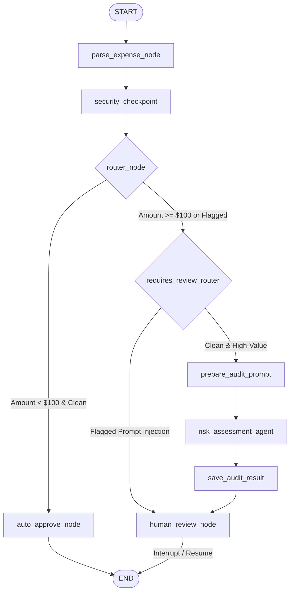

# Ambient Expense Approval Agent 🛡️💵

An automated, secure expense-approval workflow agent built with the **Google Agent Development Kit (ADK)** and **FastAPI**. 

This system enforces corporate compliance policies by automatically approving low-value expenses, analyzing large expenses with a Gemini compliance LLM, redacting sensitive Personal Identifiable Information (PII), preventing prompt injection exploits, and pausing for Human-in-the-Loop (HITL) approval when necessary.

---

## 🏗️ Workflow Architecture

The core agent workflow is defined as a graph-based state machine in [`expense_agent/agent.py`](file:///C:/Users/mdaft/OneDrive/Desktop/Kaggle/ambient-expense-agent/expense_agent/agent.py). It tracks and validates state using the [`ExpenseState`](file:///C:/Users/mdaft/OneDrive/Desktop/Kaggle/ambient-expense-agent/expense_agent/agent.py#L18-L29) Pydantic schema.



### Key Components

1. **[`parse_expense_node`](file:///C:/Users/mdaft/OneDrive/Desktop/Kaggle/ambient-expense-agent/expense_agent/agent.py#L35-L104)**: Extracts JSON or Base64-encoded Pub/Sub message data, populating fields like `amount`, `submitter`, `category`, and `description`.
2. **[`security_checkpoint`](file:///C:/Users/mdaft/OneDrive/Desktop/Kaggle/ambient-expense-agent/expense_agent/agent.py#L106-L147)**: 
   * **PII Redaction**: Scrubs SSNs and Credit Card numbers from the transaction description.
   * **Prompt Injection Detection**: Uses keyword heuristics to catch and flag attempts to bypass rules (e.g., *"override threshold"* or *"force autoapprove"*).
3. **[`router_node`](file:///C:/Users/mdaft/OneDrive/Desktop/Kaggle/ambient-expense-agent/expense_agent/agent.py#L149-L161)**: Evaluates the dollar threshold (configured as `$100.0` in [`config.py`](file:///C:/Users/mdaft/OneDrive/Desktop/Kaggle/ambient-expense-agent/expense_agent/config.py)) and security flags.
4. **[`auto_approve_node`](file:///C:/Users/mdaft/OneDrive/Desktop/Kaggle/ambient-expense-agent/expense_agent/agent.py#L163-L172)**: Instantly marks clean, low-value expenses (< $100) as approved.
5. **[`requires_review_router`](file:///C:/Users/mdaft/OneDrive/Desktop/Kaggle/ambient-expense-agent/expense_agent/agent.py#L228-L236)**: If prompt injection was flagged, the LLM risk assessment is **bypassed** entirely for safety, routing directly to human review. Otherwise, it proceeds to the audit agent.
6. **[`risk_assessment_agent`](file:///C:/Users/mdaft/OneDrive/Desktop/Kaggle/ambient-expense-agent/expense_agent/agent.py#L175-L190)**: A Gemini compliance model (`gemini-3.1-flash-lite`) that audits the expense context for suspicious activities or violations.
7. **[`human_review_node`](file:///C:/Users/mdaft/OneDrive/Desktop/Kaggle/ambient-expense-agent/expense_agent/agent.py#L238-L290)**: Suspends the workflow with a `RequestInput` event, prompting the reviewer for an `approve` or `reject` decision, then resumes to apply the final status.

---

## 🛠️ Prerequisites

* **Python**: `^3.10`
* **Poetry**: For dependency management (defined in [`pyproject.toml`](file:///C:/Users/mdaft/OneDrive/Desktop/Kaggle/ambient-expense-agent/pyproject.toml))
* **Google Gemini API Key**: Obtain a key from [Google AI Studio](https://aistudio.google.com/apikey).

---

## 🚀 Setup & Installation

1. **Install Dependencies**:
   Initialize and install dependencies using Poetry:
   ```bash
   poetry install
   ```
   *(Alternatively, if reusing a sibling environment like `First Agent`, ensure its virtual environment is activated.)*

2. **Configure Environment Variables**:
   Create or edit the local [`.env`](file:///C:/Users/mdaft/OneDrive/Desktop/Kaggle/ambient-expense-agent/.env) file:
   ```env
   # API authentication
   GOOGLE_GENAI_USE_VERTEXAI=0
   GOOGLE_API_KEY=YOUR_GEMINI_API_KEY_HERE
   
   # Turn off vertex/otel cloud telemetry export
   OTEL_TO_CLOUD=False
   ```

---

## 🏃 Running the Project

Both a [`Makefile`](file:///C:/Users/mdaft/OneDrive/Desktop/Kaggle/ambient-expense-agent/Makefile) (Linux/macOS) and a [`make.bat`](file:///C:/Users/mdaft/OneDrive/Desktop/Kaggle/ambient-expense-agent/make.bat) (Windows) wrapper are provided for convenience.

### 1. Launch the FastAPI Service
Starts the FastAPI service on local port `8080` with hot-reloading:

* **Windows**:
  ```cmd
  make.bat playground
  ```
* **Linux/macOS**:
  ```bash
  make playground
  ```

Once running, you can access the interactive API documentation at [http://127.0.0.1:8080/docs](http://127.0.0.1:8080/docs).

---

## 🔌 API Integration Examples

The service manages workflow state in a local SQLite database (`expense_agent/.adk/session.db`).

### Trigger Workflow
Send a simulated expense report payload to the service:

```bash
curl -X POST "http://127.0.0.1:8080/apps/expense_agent/trigger/pubsub" \
     -H "Content-Type: application/json" \
     -d '{
       "subscription": "projects/local/subscriptions/expense-sub-123",
       "message": {
         "data": {
           "amount": 250.00,
           "submitter": "Alice Smith",
           "category": "Travel",
           "description": "Hotel accommodation for regional tech conference",
           "date": "2026-06-19"
         }
       }
     }'
```

#### Example Responses:
* **For Low-Value Expense (< $100):**
  ```json
  {
    "status": "completed",
    "session_id": "expense-sub-123",
    "state": {
      "amount": 45.5,
      "submitter": "Alice",
      "category": "Meals",
      "description": "Team lunch at local bistro",
      "date": "2026-06-18",
      "risk_assessment": null,
      "approval_status": "Approved (Auto)",
      "redacted_categories": [],
      "security_flag": false
    }
  }
  ```

* **For High-Value Expense (>= $100):**
  The request suspends, asking for human intervention:
  ```json
  {
    "status": "suspended",
    "session_id": "expense-sub-123",
    "invocation_id": "inv_01j3v...",
    "action_required": "Human Review Needed",
    "message": "\n⚠️ ACTION REQUIRED: Human Review Needed\n..."
  }
  ```

### Resume a Suspended Workflow
To submit a human approval decision, send a resume request specifying the `session_id`, `invocation_id`, and `decision` (`approve` or `reject`):

```bash
curl -X POST "http://127.0.0.1:8080/apps/expense_agent/resume" \
     -H "Content-Type: application/json" \
     -d '{
       "session_id": "expense-sub-123",
       "invocation_id": "YOUR_INVOCATION_ID_HERE",
       "decision": "approve"
     }'
```

---

## 🧪 Evaluation & Testing

The project includes built-in test datasets and scoring scripts to assess the routing and security behavior of the agent workflow.

### 1. Generate Traces
Run the test scenarios defined in [`tests/eval/datasets/basic-dataset.json`](file:///C:/Users/mdaft/OneDrive/Desktop/Kaggle/ambient-expense-agent/tests/eval/datasets/basic-dataset.json) to execute the workflow nodes and output trace logs:

* **Windows**:
  ```cmd
  make.bat generate-traces
  ```
* **Linux/macOS**:
  ```bash
  make generate-traces
  ```
Traces are compiled and saved to `artifacts/traces/generated_traces.json`.

### 2. Grade Traces
Grade the compiled traces against routing and security benchmarks:

* **Windows**:
  ```cmd
  make.bat grade
  ```
* **Linux/macOS**:
  ```bash
  make grade
  ```

This uses the evaluations configuration [`tests/eval/eval_config.yaml`](file:///C:/Users/mdaft/OneDrive/Desktop/Kaggle/ambient-expense-agent/tests/eval/eval_config.yaml) to run LLM-as-a-judge evaluations for:
* **`routing_correctness`**: Checks if transactions are properly routed based on the configured dollar threshold.
* **`security_containment`**: Measures if PII is correctly scrubbed and if prompt injection results in the LLM being bypassed and routed directly to a human.

HTML and JSON grading reports are saved inside the `artifacts/grade_results/` directory.

---

## 📂 Project Directory Structure

```text
ambient-expense-agent/
├── .env                          # Local Environment configuration (API keys)
├── Makefile                      # Make targets for dev commands
├── make.bat                      # Windows cmd script for dev commands
├── pyproject.toml                # Poetry packages & dependencies
├── artifacts/
│   ├── grade_results/            # HTML/JSON evaluation reports
│   └── traces/
│       └── generated_traces.json # Recorded traces from test runs
├── expense_agent/
│   ├── .adk/                     # Local SQLite database cache
│   ├── __init__.py
│   ├── agent.py                  # Workflow graph nodes, agents, and state schemas
│   ├── config.py                 # Threshold and LLM configuration settings
│   └── service.py                # FastAPI HTTP entrypoint endpoints
└── tests/
    └── eval/
        ├── datasets/
        │   └── basic-dataset.json # Test scenario inputs (PII, injection, values)
        ├── eval_config.yaml      # Evaluation metrics & judges config
        └── generate_traces.py    # Python script simulating eval dataset execution
```
